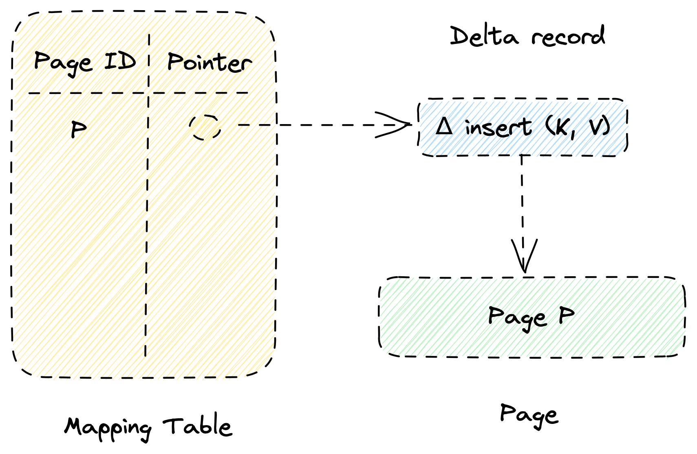
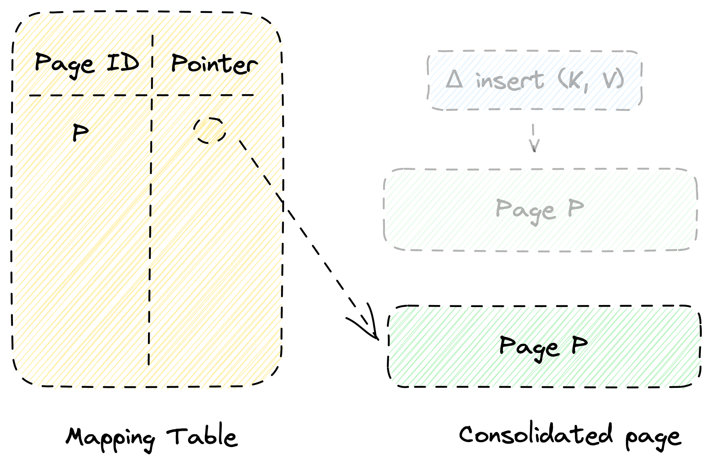

# Bw-Tree for Rust

This is a _work-in-progress_ implementation of Bw-Trees for Rust.

Nothing works, this is mostly for my own education right now.

## Design

The Bw-Tree is a specialized version of the B+-Tree designed for modern multi-core machines.
One key distinction between the Bw-Tree and the traditional B+-Tree is how they handle page modifications.
Unlike the B+-Tree, the Bw-Tree does not directly modify pages in place.
Instead, it employs a strategy to store changes as delta records and later consolidate them into a page.
The use of delta records serves a specific purpose, namely to prevent excessive CPU cache trashing during insertions.
By deferring the consolidation of modifications, the Bw-Tree optimizes performance by minimizing cache-related inefficiencies.

Another notable distinction between the Bw-Tree and the B+-Tree is that the Bw-Tree is lock-free, often referred to as "latch-free" in the context of databases.
The Bw-Tree references pages using logical IDs instead of physical pointers. A mapping table data structure manages the translation between logical IDs and pointers.
Whenever a page requires a delta record or when consolidation of a page takes place, a logical ID is updated to map to a new pointer using an atomic compare-and-swap instruction.
The atomic operation ensures the integrity of the mapping and allows for concurrent and consistent modifications within the Bw-Tree without the need for locks.

Figure 1 shows an example of a Bw-Tree with one page, *P*.
The mapping table has a logical ID entry with a pointer to the actual page.

Figure 1. Example of a Bw-Tree.

Figure 2 shows the same Bw-Tree, but after one insertion.
The mapping table now maps the page P logical ID to a delta record, which represents the insertion.
To look up a key `K`, you always go through the delta records before descending to the page.

Figure 2. Bw-Tree after insertion.

Finally, Figure 3 shows the Bw-Tree after the delta chain has been consolidated to a new page.
The mapping table now points to a new page *P* which includes all the accumulated delta records.
The delta records and the old page are garbage collected when possible.

Figure 3. Bw-Tree after page consolidation.

## References

"The Bw-Tree: A B-tree for New Hardware Platforms" by Justin J. Levandoski _et al._ (ICDE '13) [[PDF](https://15721.courses.cs.cmu.edu/spring2017/papers/08-oltpindexes2/bwtree-icde2013.pdf)]

"The Bw-Tree Key-Value Store: From Research to Production" by Sudipta Sengupta (NWDS, February 2016) [[YouTube](https://www.youtube.com/watch?v=Pr-b9stpAV4)]

"Building a Bw-Tree Takes More Than Just Buzz Words" by Ziqi Wang _et al._ (SIGMOD '18) [[PDF](https://www.cs.cmu.edu/~huanche1/publications/open_bwtree.pdf)] [[YouTube](https://www.youtube.com/watch?v=UxuFL8dgiEw)]
